<p align="center">
  
</p>

<p align="center">
  Block-based text art generator for terminal and SVG.
</p>

## Install

```sh
npm install termtype
```

## Examples

### Solid colors

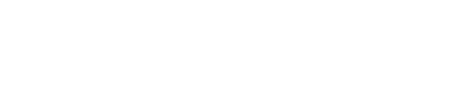

```sh
termtype "Hello" --font=sans --color=white
```


```sh
termtype "ARCADE" --font=block --color=lime
```


```sh
termtype "Quiz.ai" --font=block --color=gold
```


```sh
termtype "hack" --font=block --color=lime
```

### Gradients

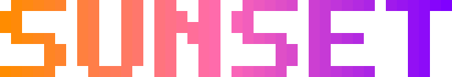

```sh
termtype "sunset" --font=bold --gradient=orange,pink,purple
```

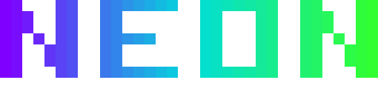

```sh
termtype "NEON" --font=block --gradient=purple,cyan,lime
```

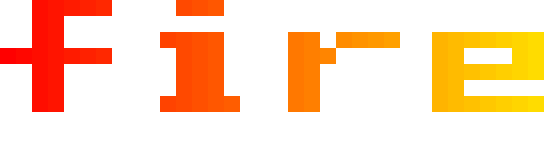

```sh
termtype "fire" --font=block --gradient=red,yellow
```

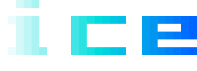

```sh
termtype "ice" --font=block --gradient=white,cyan,blue
```

### Rainbow

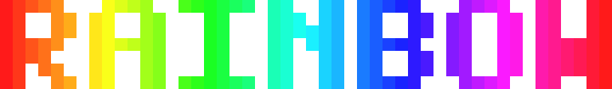

```sh
termtype "rainbow" --font=bold --rainbow
```

### Per-word colors

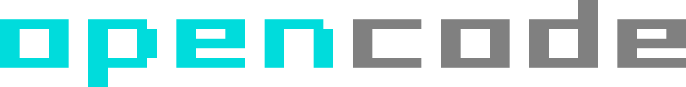

```sh
termtype "open|code" --font=block --color=cyan,gray
```

Use `|` as a zero-width color separator (no space between words). Use commas to assign colors to words.

### Effects


```sh
termtype "RETRO" --font=block --color=coral --shadow
```

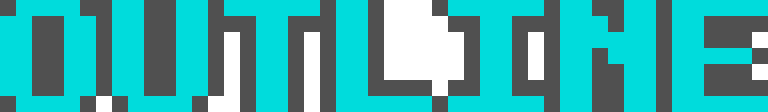

```sh
termtype "outline" --font=bold --color=cyan --outline
```

### Fonts


```sh
termtype "Hello" --font=sans
```

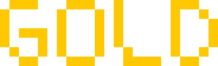

```sh
termtype "GOLD" --font=serif --color=gold
```

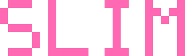

```sh
termtype "slim" --font=slim --color=pink
```

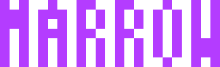

```sh
termtype "NARROW" --font=narrow --color=violet
```


```sh
termtype "ARCADE" --font=block --color=lime
```

| Font | Style | Width |
|------|-------|-------|
| `sans` | Clean default | 5px |
| `serif` | Decorative serifs | 5px |
| `slim` | Thin strokes | 5px |
| `bold` | Heavy weight | 6px |
| `narrow` | Condensed | 3px |
| `block` | Chunky geometric | 7px |

## CLI

```
termtype <text> [options]

Options:
  --color=<color>       Text color (name or hex, default: white)
                        Use commas for per-word colors (e.g. cyan,gray)
  --gradient=<a,b>      Gradient from color A to B (e.g. red,yellow)
                        Supports 3-stop: --gradient=red,yellow,green
  --rainbow             Rainbow color mode
  --font=<name>         Font: sans (default), serif, slim, bold, narrow, block
  --size=<size>         Size: sm, md (default), lg
  --compact             Half-block mode (sm is always compact)
  --shadow              Add drop shadow
  --shadow-color=<c>    Shadow color (default: gray)
  --outline             Add outline around text
  --border              Add pixel-art border frame
  --padding=<n>         Padding around text (default: 1)
  --svg                 Output SVG instead of terminal
  --size-px=<n>         SVG pixel size (default: 16)
  --out=<file>          Write output to file
  -h, --help            Show this help
```

## API

```ts
import { composeText, renderTerminal, renderSVG, applyPadding, applyShadow } from "termtype";

const grid = composeText("Hello", { font: "block" });
const padded = applyPadding(grid, 1);

// Terminal output
const lines = renderTerminal(padded, {
  colorMode: { type: "solid", color: [0, 220, 220] },
});
console.log(lines.join("\n"));

// SVG output
const svg = renderSVG(grid, {
  colorMode: { type: "rainbow" },
  pixelSize: 16,
});
```

### Color modes

```ts
// Solid
{ type: "solid", color: [255, 0, 0] }

// Gradient (2 or 3 stops)
{ type: "gradient", from: [255, 0, 0], to: [255, 255, 0], direction: "horizontal" }
{ type: "gradient", from: [255, 0, 0], via: [255, 255, 0], to: [0, 255, 0], direction: "horizontal" }

// Rainbow
{ type: "rainbow" }

// Per-segment
{ type: "segments", segments: [{ endX: 20, mode: { type: "solid", color: [0, 220, 220] } }] }
```

### Named colors

`white` `black` `red` `green` `blue` `yellow` `cyan` `magenta` `orange` `pink` `purple` `lime` `teal` `navy` `gold` `gray` `coral` `violet` `silver` `darkgray` `lightgray`

## SVG output

SVGs render as flat pixel art on a transparent background, ready to use on websites. Same-color pixels are merged into single `<path>` elements for minimal file size.

```sh
termtype "Logo" --svg --color=cyan --out=logo.svg
```

## License

MIT
